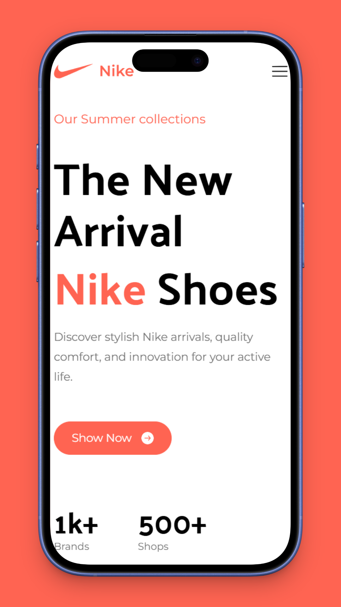
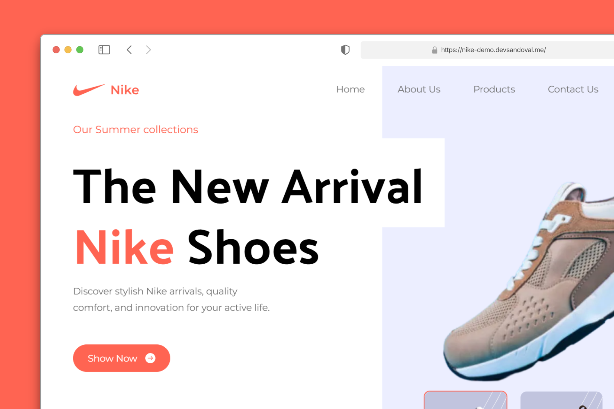

# Nike Website Demo 👟

<div align="center">
  
  
  
  
  
</div>

---

## 🧾 Descripción del Proyecto

**Nike Website Demo** es una **landing page moderna y responsive** que replica el diseño y la experiencia de usuario de la página oficial de Nike. Este proyecto ha sido desarrollado como una **demostración de habilidades técnicas** para mi portafolio profesional.

### 🎯 Objetivo Principal

Crear una experiencia web inmersiva que demuestre expertise en tecnologías frontend modernas, enfocándose en diseño responsive, performance y interactividad.

### ⚙️ Tecnologías Principales

- **Astro 5.8** - Framework web moderno para sitios estáticos
- **TypeScript** - Tipado estático para mayor robustez del código
- **Tailwind CSS** - Framework de CSS utilitario para diseños rápidos
- **Custom CSS Variables** - Sistema de diseño personalizado

### ✨ Características Destacadas

- 🎨 **Diseño Pixel-Perfect** inspirado en Nike oficial
- 📱 **100% Responsive** adaptable a todos los dispositivos
- ⚡ **Optimización de Performance** con carga rápida de imágenes
- 🎭 **Interactividad Avanzada** con selección dinámica de productos
- 🔄 **Navegación Fluida** con scroll suave entre secciones
- 🎪 **Modal de Disclaimer** con información del proyecto
- 📦 **Arquitectura Modular** con componentes reutilizables

### 📱 Diseño Responsive y Usabilidad

La página está optimizada para ofrecer una experiencia excepcional en desktop, tablet y móvil, con navegación intuitiva y elementos interactivos que responden perfectamente al usuario.

---

## 🚀 Instalación y Ejecución

### Prerrequisitos

- Node.js 18.14.1 o superior
- pnpm (recomendado) o npm

### Instalación paso a paso

```bash
# 1. Clonar el repositorio
git clone https://github.com/sandovaldavid/nike-website-demo.git

# 2. Navegar al directorio
cd nike-website-demo

# 3. Instalar dependencias
pnpm install

# 4. Ejecutar en modo desarrollo
pnpm dev
```

### 📋 Comandos Disponibles

| Comando              | Descripción                                    |
|---------------------|------------------------------------------------|
| `pnpm dev`          | Inicia servidor de desarrollo en `localhost:4321` |
| `pnpm build`        | Construye el sitio para producción            |
| `pnpm preview`      | Previsualiza la build localmente              |
| `pnpm lint`         | Ejecuta el linter para revisar código         |
| `pnpm format`       | Formatea el código con Prettier               |

---

## 🖼️ Capturas de Pantalla

<div align="center">
  <table>
    <tr>
      <th>Mobile</th>
      <th>Desktop</th>
    </tr>
    <tr>
      <td></td>
      <td></td>
    </tr>
  </table>
</div>

---

## 🧪 Tecnologías Utilizadas

| Tecnología | Descripción |
|------------|-------------|
|  | Framework web estático moderno |
|  | Superset de JavaScript con tipado |
|  | Framework CSS utility-first |
|  | Linter para mantener calidad del código |
|  | Formateador de código |
|  | Gestor de paquetes rápido y eficiente |

---

## 🤝 Contribuciones

[](https://github.com/sandovaldavid/nike-website-demo/pulls)

¡Las contribuciones son bienvenidas! Si deseas colaborar:

1. **Crea un fork** 🪝 del repositorio
2. **Crea una rama** 🌿 para tu feature (`git checkout -b feature/nueva-funcionalidad`)
3. **Realiza tus cambios** ✅ y commitea (`git commit -m 'Agrega nueva funcionalidad'`)
4. **Push a la rama** 📤 (`git push origin feature/nueva-funcionalidad`)
5. **Abre un Pull Request** 🧵

---

## 🧾 Licencia


Distribuido bajo la licencia MIT. Consulta [LICENSE](./LICENSE) para más información.

---

## 📬 Contacto

- 🌐 **Portafolio:** [devsandoval.me](https://devsandoval.me)
- 💼 **LinkedIn:** [@devsandoval](https://linkedin.com/in/devsandoval)
- 💻 **GitHub:** [@sandovaldavid](https://github.com/sandovaldavid)
- 📧 **Email:** [contact@devsandoval.me](mailto:contact@devsandoval.me)

---

<div align="center">
  <i>✨ Desarrollado por <a href="https://devsandoval.me/">David Sandoval</a> © 2025</i>
</div>
